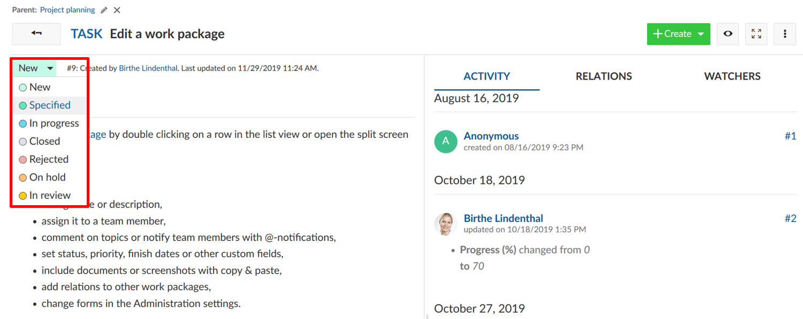
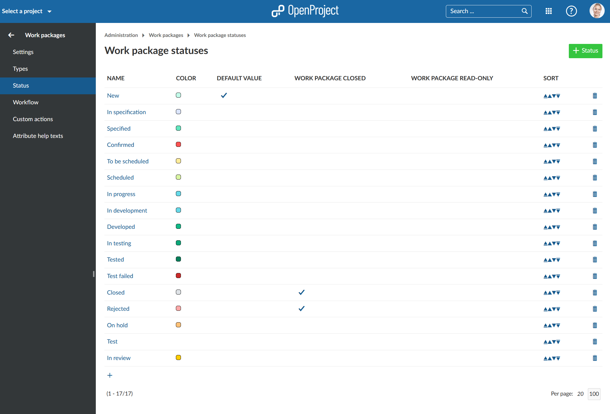
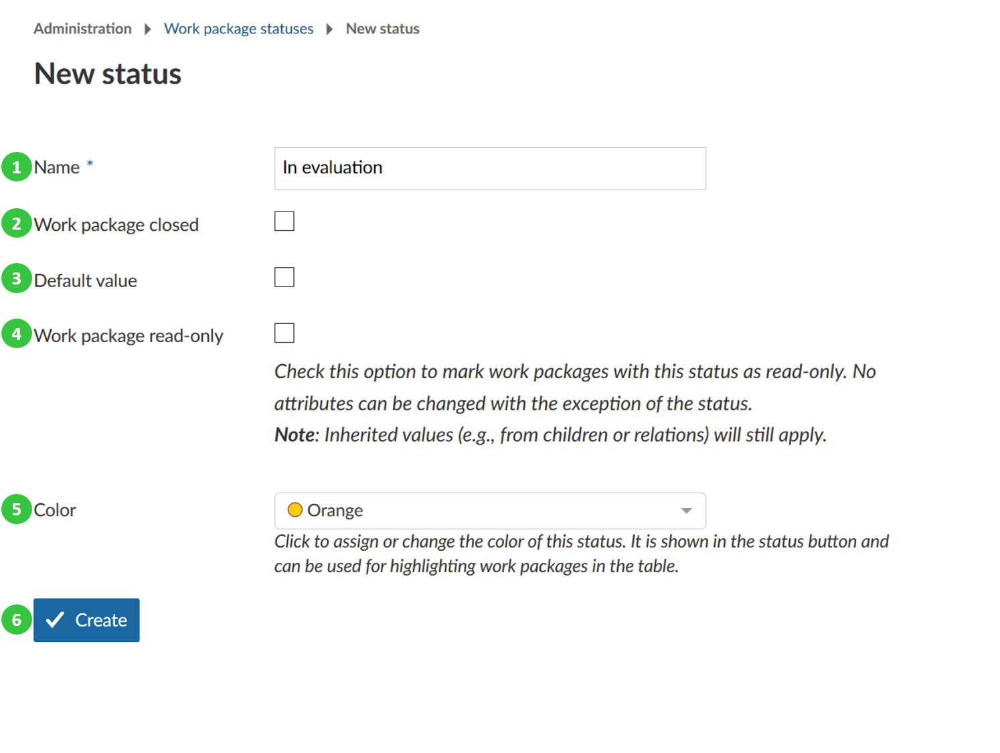
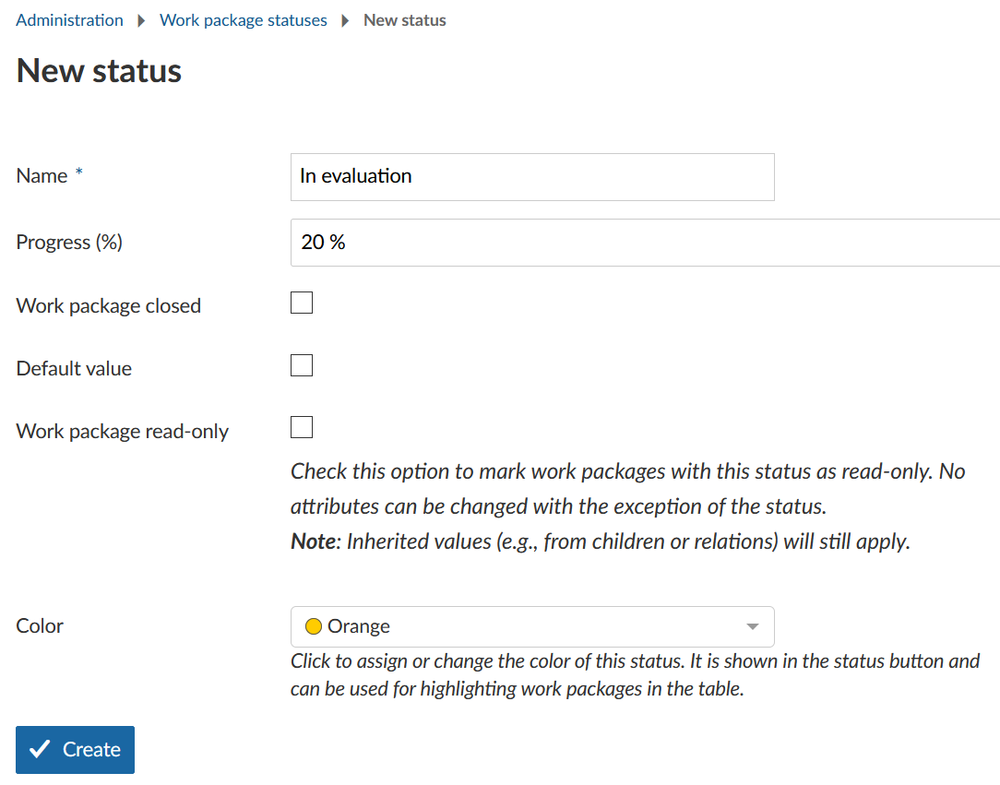

---
sidebar_navigation:
  title: Status
  priority: 970
description: Manage Work package status.
robots: index, follow
keywords: work package status
---

# Manage work package status

Work packages can have various status depending on their types, e.g. tasks can have the status new, in progress, done, on hold, rejected, closed. Or any other status which you would need.

The status can be set at the top of the work package details view or in the list view in the corresponding column.

The status field can be configured under *Administration ->* *Work packages* -> *Status*. You will see the list of all the existing work package status in the system. You can add new status or change the name and order of existing status. 
To learn about the options for configuring the transition from one status to another navigate to [Manage work package workflows](../work-package-workflows).

## Create a new work package status

To create a new work package status click the green ***+ New Status*** icon. 

A new window will open, where you will be able to specify the following:

1. Name the new work package status.
2. Define if the new work package status closes a work package (e.g. relevant when filtering for closed for packages), e.g. a work package status "rejected" will set a work package technically on closed and it will not appear in the default work package list with Open Work packages.
3. Define if this status is set as default value when creating new work packages.
4. Check if this status sets a **work package in read-only mode**. This means no work package attributes can be changed except the status.
5. Set a **color** for the work package status. The color appears in the status button of the work packages or in the work package table.
6. Save the new status by clicking **Create**.

## Edit, re-order or remove a work package status

1. To **edit** an existing work package status click on the status name. 
2. To **sort** the status, e.g. in the status drop-down list of the work packages, click on the arrows to move the status up or down in the list.
3. To **delete** the work package status click on the delete icon.

**Note**: A new status needs to be activated in the [work package workflows](../work-package-workflows) in order to appear in the status drop down of a work package.

## "Use the work package status" activated

If you chose to use the *work package status* for progress calculations in the [work package settings (#4)](../work-package-settings) you will find **another option ("Progress (%)")** in a status' settings. Here you can define which progress ratio should be shown for a work package in this status.

In the status list the button "Update work package done ratios" is shown in the status list. Clicking it will ........................................................................................................................... ...................... ........

Furthermore, an additional column "Progress" is shown in the list.

### Effects of progress calculation by status on work packages

Changing to the progress calculation by status and back to "use work package field" in the [work package settings](../work-package-settings) will have these effects on the displayed progress ratio of a work package:

- Changing *to* "Use the work package status"
  - When a progress ratio is defined for the status the work package is in: The defined progress ratio will be set
  - When no progress ratio is defined for the status the work package is in: The progress ratio won't be changed, the manually set value will be kept.
- Changing back to "Use the work package field"
  - When a progress ratio has been set manually earlier and the status has not been to changed to a status with defined progress ratio since: The manually set value will be restored
  - When no progress ratio has been set manually earlier and the status is "Closed" (or another type of status defined as closed): The value will stay "100%".
  - In all other cases: The current value will be kept until changed manually.

It may be necessary to reload the work package's page before these effects become visible.

[The effect of changing a child's progress will be added soon.]